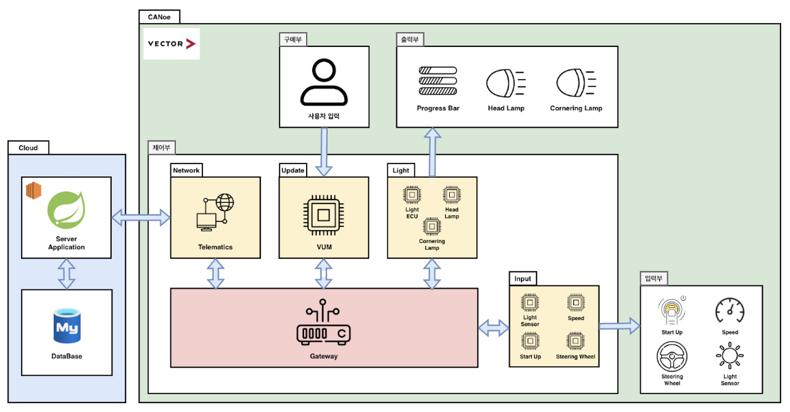
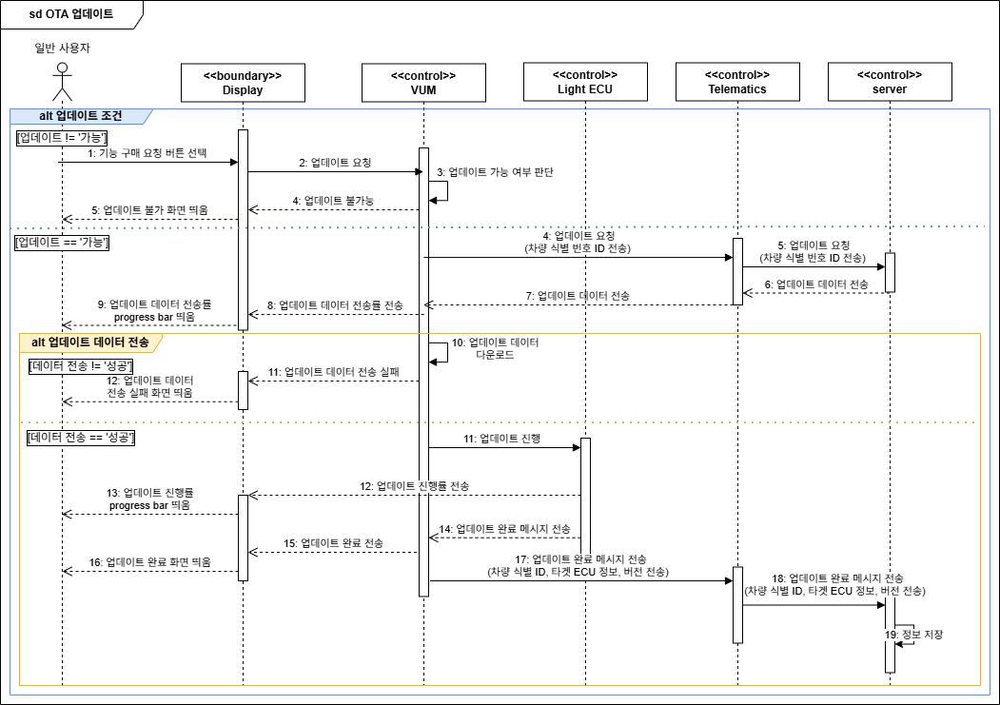
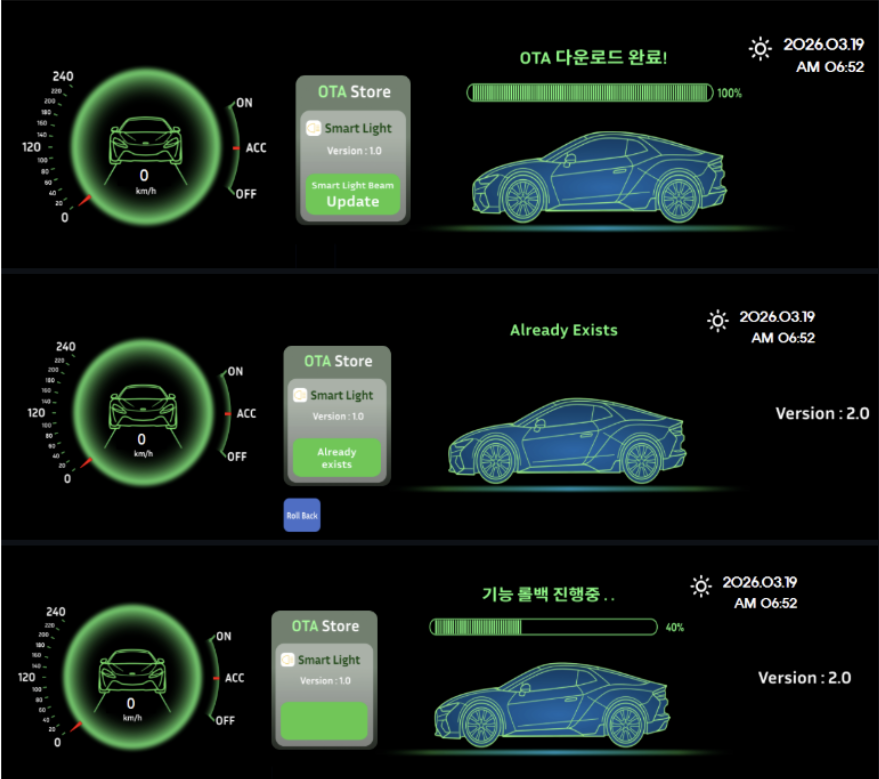
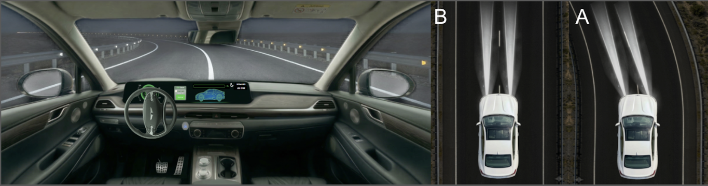
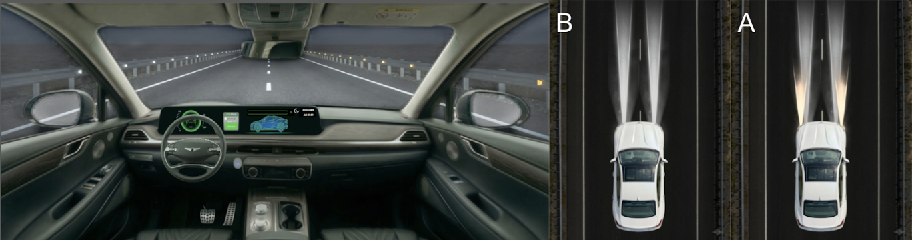

# OTA 기반 첨단 차량 기능 업데이트 시스템
**MOBIUS Bootcamp 1기 PBL4-3 프로젝트**

**팀명 Nobrake**

## 1. 📜 프로젝트 개요 (Overview)

   본 프로젝트는 기존에 OTA(Over-the-Air) 기능이 탑재되지 않은 차량을 대상으로, 외부 서버로부터 소프트웨어를 무선으로 수신하여 차량 내 제어기(ECU)를 최신화하는 통합 OTA 업데이트 아키텍처를 설계하고 검증하는 것을 목적으로 합니다.
   
   업데이트 과정 중 발생할 수 있는 보안 위협과 안전 사고를 방지하기 위한 다중 안전 로직 구현에 중점을 두었습니다.

## 2. 🚀 주요 기능 (Key Features)

✅ New 소프트웨어 업데이트 : 
- 기존에 없던 새로운 기능(스마트 라이트 빔 시스템) 추가

🎮 운전자 인터페이스 (HMI) : 

- 실시간 펌웨어 업데이트 진행 시각화

☁️ OTA (Over-the-Air) 업데이트 : 

- 클라우드 기반 인프라
- 차량 Telematics에서 클라우드에 업데이트 데이터 요청

## 3. 🏗 시스템 아키텍처 (System Architecture)

.
.

## 4. 시나리오 (시퀀스 다이어그램)

.
.

## 5. 구현 (CANoe)

.
.

## 6. 🧪 검증 (Verification)
본 프로젝트는 Automotive SPICE (A-SPICE) V-Model 개발 프로세스를 준수하여 요구사항 설계부터 시스템 통합 검증까지 체계적인 으로 수행했습니다.

단위 검증 : 

통합 검증 : 

###  시나리오 (시퀀스 다이어그램)

### 시연 결과 (패널)
<h4>[OTA Update]</h4>

<h4>[코너링 라이트]</h4>

<h4>[야간 주행 시 전조등 자동 점등]</h4>

.
.

## 9. 🛠 개발 환경 및 도구 (Development Environment & Tools)

.
.

## 10. 👥 팀원 및 역할 (Team & Roles)
### 역할 분담
| 담당   | 역할/책임                         |
|--------|-----------------------------------|
| 송호준(팀장)  | CANoe(VUM)       |
| 김지수 | 서버 및 CANoe(TMU)       |
| 노을   | CANoe(ECU)       |
| 임나경 | CANoe(ECU)       |
| 백현웅   | CANoe(VUM)       |
